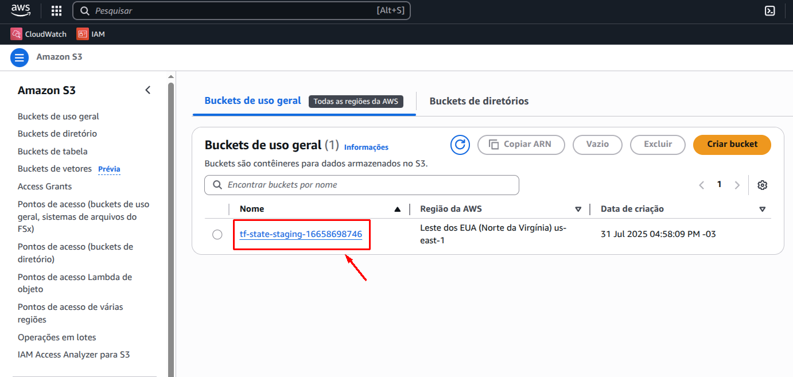

# Terraform Bootstrap

Este projeto define a infraestrutura base necessária para usar **Terraform com backend remoto na AWS**, incluindo:

- Bucket S3 para armazenar o `terraform.tfstate`
- Pipeline GitHub Actions reutilizável via `workflow_call`

> ⚠️ **Atualização importante:** A partir do Terraform `1.11.0`, não é mais necessário provisionar uma tabela DynamoDB para controle de lock do `terraform.tfstate`. O Terraform agora utiliza **lock nativo via arquivo `.tflock` no S3**.

---

> ## Objetivo

Fornecer uma base reutilizável para projetos Terraform que necessitam de backend remoto na AWS. Com este repositório, você pode:

- Provisionar o backend (apenas o bucket S3) com um clique ou pipeline automatizada
- Padronizar a criação de infraestrutura básica entre projetos
- Facilitar o onboarding de novos repositórios e ambientes

---

> ## Recurso Provisionado

| Tipo            | Nome padrão                              | Observações importantes                                                  |
|-----------------|-------------------------------------------|--------------------------------------------------------------------------|
| S3 Bucket       | `tf-state-<environment>-<unique_id>`                 | Versão + nome unico + criptografia + tags + bloqueio público + ownership controls    |

---

> ## Estrutura do Repositório

```bash
terraform-bootstrap/
├── main.tf               # Código principal do Terraform
├── variables.tf          # Variáveis do projeto
├── outputs.tf            # Retorna o nome do Bucket provisionado
├── terraform.tfvars      # (Opcional) Para uso local
├── .github/
│   └── workflows/
│       └── bootstrap.yml # Workflow reutilizável por outros projetos
└── README.md             # Este arquivo
```

> ## Como Usar

### Requisitos

- Conta AWS com credenciais válidas (Access Key + Secret)  
- Terraform CLI >= 1.11.0  
- Permissões para rodar workflows no GitHub  

### Uso Local (Manual)

```bash
terraform init
terraform plan -var="environment=dev"
terraform apply -auto-approve -var="environment=dev"
```

> ## Uso via GitHub Actions `workflow_call`

Você pode reutilizar este pipeline de bootstrap em qualquer outro projeto Terraform. Crie um workflow como abaixo no projeto consumidor:

```yaml
# .github/workflows/bootstrap.yml em outro projeto
name: Infra Bootstrap

on:
  workflow_dispatch:
    inputs:
      environment:
          description: The environment to deploy
          type: choice
          required: true
          options:
              - prod
              - staging

jobs:
  call-bootstrap:
    uses: vinicius3516/terraform-bootstrap/.github/workflows/bootstrap.yml@main
        with:
            environment: ${{ github.event.inputs.environment }}
        secrets:
            AWS_REGION: ${{ secrets.AWS_REGION }}
            AWS_ACCESS_KEY_ID: ${{ secrets.AWS_ACCESS_KEY_ID }}
            AWS_SECRET_ACCESS_KEY: ${{ secrets.AWS_SECRET_ACCESS_KEY }}
```
> Importante:
Substitua `vinicius3516` pelo nome correto da organização ou conta GitHub, se você tiver feito um fork do projeto.

> ## Como configurar o backend nos projetos consumidores

Após provisionar o bucket S3 com este projeto, os demais projetos Terraform devem configurar o backend remoto da seguinte forma:

```hcl
terraform {
  required_version = ">= 1.11.0"

  backend "s3" {
    bucket       = "tf-state-<environment>-<unique_id>"
    key          = "path/to/terraform.tfstate"
    region       = "us-east-1"
    encrypt      = true
    use_lockfile = true
  }
}
```
### Importante:
O parâmetro `use_lockfile = true` ativa o mecanismo de locking automático do Terraform, substituindo a necessidade de uma tabela DynamoDB.

> ## Input disponível no `workflow_call`

| Nome        | Tipo    | Obrigatório | Descrição                                      |
|-------------|---------|-------------|------------------------------------------------|
| environment | string  | ✅          | Nome do ambiente (dev, staging, prod)          |
|      |   |         |      |

> ## Secrets necessárias

| Nome                  | Descrição                                           |
|-----------------------|-----------------------------------------------------|
| AWS_ACCESS_KEY_ID     | Access key de uma IAM user com permissão           |
| AWS_SECRET_ACCESS_KEY | Secret key correspondente                          |
| AWS_REGION            | Região na Aws                                      |

> **Importante:**  
> Você deve configurar esses secrets no repositório que chama o bootstrap (não no bootstrap em si):  
> Vá para **Settings > Secrets and variables > Actions** e adicione os tres secrets lá.

> ## Boas práticas implementadas no backend S3

O bucket provisionado pelo `terraform-bootstrap` é configurado com diversas proteções e práticas recomendadas pela AWS:

| Recurso                     | Descrição                                                                 |
|-----------------------------|---------------------------------------------------------------------------|
| Criptografia AES256      | Todos os arquivos no bucket são criptografados automaticamente             |
| Bloqueio de acesso público | Nenhuma ACL ou política pode tornar o bucket ou objetos públicos           |
| Ownership Controls        | O bucket sempre será dono dos objetos enviados, mesmo via STS ou terceiros |
| Versionamento ativado    | Cada alteração no state é versionada automaticamente                       |
| Tags padronizadas        | Tags como `Environment` e `ManagedBy` são aplicadas de forma consistente   |

> ## Resultado Esperado

Após aplicar o Terraform, você deverá ver o bucket provisionado no console da AWS S3 com o nome esperado (por exemplo, `tf-state-staging-<unique_id>`):


